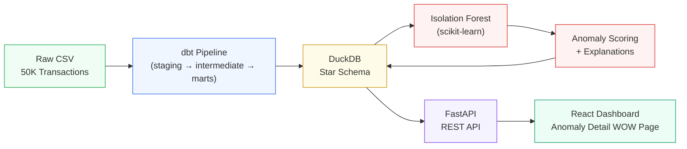

# FinSight Lite

An end-to-end anomaly detection pipeline that ingests banking transactions, transforms them through a dimensional model using dbt, and flags suspicious activity with human-readable explanations.

**Tags:** ML, Python, dbt, DuckDB, FastAPI, React, scikit-learn
**Role:** Data Engineer / ML Engineer
**Category:** ML

## Architecture



## Quick Start

```bash
docker compose up --build
```

Then visit [http://localhost:3000](http://localhost:3000)

The first run takes a few minutes as the API container automatically:
1. Generates 50K synthetic transactions
2. Runs dbt transformations (staging → intermediate → marts)
3. Trains the Isolation Forest model
4. Scores all transactions and generates explanations
5. Starts serving the API

### Local Development (without Docker)

```bash
# Install dependencies
pip install -r requirements.txt

# Run the full pipeline
python -m ml.run_pipeline

# Start API (terminal 1)
./scripts/dev_api.sh

# Start frontend (terminal 2)
cd frontend && npm install && npm run dev
```

## Tech Stack

| Layer | Technology |
|-------|-----------|
| Data Warehouse | DuckDB (local, file-based) |
| Transformations | dbt-core + dbt-duckdb |
| Data Generation | Python, Faker |
| ML | scikit-learn (Isolation Forest), joblib |
| Backend | FastAPI + Uvicorn |
| Frontend | React + TypeScript + Recharts + React Router |
| Infrastructure | Docker + Docker Compose |

## Project Structure

```
.
├── data/
│   └── raw/transactions.csv       # 50K synthetic transactions
├── dbt_project/
│   ├── models/
│   │   ├── staging/               # stg_transactions (type casting, renaming)
│   │   ├── intermediate/          # int_transactions_enriched (joins + features)
│   │   └── marts/                 # fct_transactions, dim_customer, dim_merchant, dim_time
│   ├── tests/                     # Custom data quality tests
│   ├── dbt_project.yml
│   └── profiles.yml
├── ml/
│   ├── generate_data.py           # Deterministic data generation (seed=42)
│   ├── train.py                   # Isolation Forest training
│   ├── score.py                   # Transaction scoring
│   ├── explain.py                 # Human-readable explanation generation
│   └── run_pipeline.py            # End-to-end orchestrator
├── api/
│   ├── main.py                    # FastAPI app with CORS
│   ├── routes.py                  # All API endpoints
│   ├── models.py                  # Pydantic response models
│   └── db.py                      # DuckDB connection helper
├── frontend/
│   └── src/
│       ├── pages/                 # Dashboard, TransactionFeed, AnomalyDetail
│       ├── components/            # StatsCards, TimelineChart, FilterBar, TransactionList
│       └── api/client.ts          # API client with TypeScript types
├── tests/test_api.py              # API integration tests
├── scripts/                       # Dev, run, and Docker scripts
├── docker-compose.yml
├── Dockerfile.api
├── Dockerfile.frontend
└── requirements.txt
```

## API Endpoints

| Method | Endpoint | Description |
|--------|----------|-------------|
| `GET` | `/health` | Health check |
| `GET` | `/api/transactions` | Paginated transactions with filters (date range, amount, anomaly status) |
| `GET` | `/api/transactions/{id}` | Single transaction detail |
| `GET` | `/api/anomalies` | Anomalies sorted by score descending |
| `GET` | `/api/anomalies/{id}/explain` | Top 3 anomaly reasons with severity |
| `GET` | `/api/stats` | Dashboard summary (counts, rates, daily volume, top categories) |
| `GET` | `/api/customers/{id}/history` | Customer spending history for sparkline |
| `POST` | `/api/model/retrain` | Re-run full pipeline (idempotent) |

---

## Portfolio Write-up

### FinSight

Before starting my data engineering internship at RBC Borealis, I wanted to deeply understand what a production-grade financial data pipeline looks like — not just the ML model, but the entire journey from raw data to actionable insights.

FinSight ingests synthetic banking transactions, transforms them through a dimensional data model using dbt, trains an Isolation Forest to detect anomalies, and surfaces flagged transactions through an interactive dashboard. Each anomaly comes with human-readable explanations — not just "this is suspicious," but "this transaction is 7x this customer's average, occurred at 2 AM, and is their first international purchase."

The goal wasn't just to build a model. It was to build the system around the model — proper data transformations, quality tests, a serving API, and a frontend that makes the output useful to a human analyst.

### Dimensional Data Model

The pipeline implements a star schema in DuckDB:

- **`fct_transactions`** — Central fact table with enriched features (amount z-score, time features, merchant flags)
- **`dim_customer`** — Customer spending profiles (averages, standard deviations, usual transaction hours)
- **`dim_merchant`** — Merchant profiles (category, average amount, unique customer count)
- **`dim_time`** — Date dimension derived from transaction timestamps

dbt manages three transformation layers:
1. **Staging** — Type casting and column renaming from raw CSV
2. **Intermediate** — Feature engineering: joins customer/merchant stats, computes z-scores, time gaps, burst detection
3. **Marts** — Final star schema tables consumed by the ML pipeline and API

### Anomaly Detection

An **Isolation Forest** (scikit-learn, 200 estimators, contamination=0.03) trained on 50K synthetic transactions flags the top ~3% as suspicious. Features include:

- `amount`, `hour`, `day_of_week`, `is_weekend`
- `is_international`, `amount_zscore`
- `time_since_last_txn`, `is_new_merchant`
- `txn_count_last_hour`

### Explainability

Each flagged transaction gets the **top 3 human-readable reasons** ranked by severity (0–1):

- **Unusual Amount** — "$10,915 is 71.7x above this customer's average of $152"
- **Unusual Time** — "Transaction at 3:22 AM; customer typically transacts between 9:00–17:00"
- **Unusual International Activity** — "International transaction from London — no prior international history"

### Dashboard

The React frontend includes:
- **Dashboard** — Stats cards, daily volume timeline chart with anomaly overlay, filter bar, transaction feed with anomaly highlighting
- **Transaction Feed** — Full paginated list with date/amount/anomaly filters
- **Anomaly Detail (WOW Page)** — Anomaly score ring, severity bars for top 3 reasons, transaction details, customer profile stats, and a customer spending sparkline

### What I'd Add Next

- Kafka streaming ingestion for real-time transaction processing
- Drift detection to monitor model performance degradation over time
- SHAP values for more granular feature-level explainability
- Ensemble methods (combining Isolation Forest with Autoencoders)
- Alerting system with configurable thresholds and notification channels
